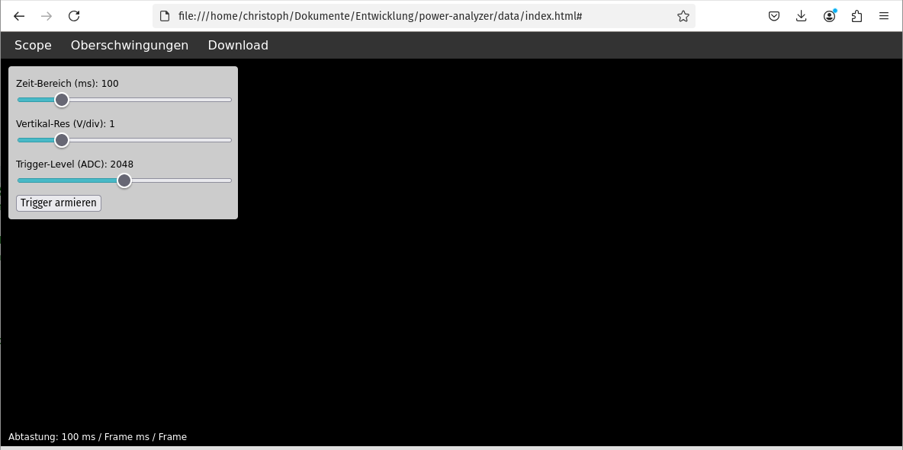
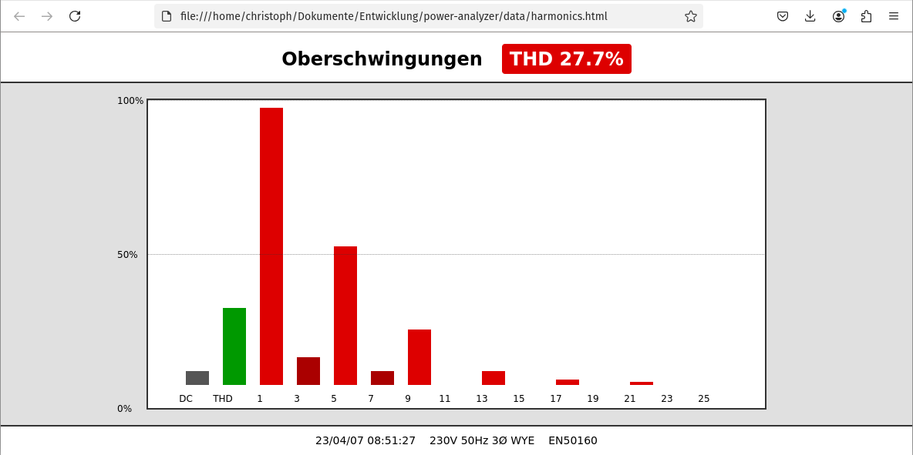

# ESP32 Power Analyzer

Ein ESP32-basiertes Messgerät zur Erfassung von harmonischen Oberwellen und Netzrückwirkungen in Echtzeit.


## Features

- Echtzeit-Oszilloskop für Spannung & Strom
- Oberschwingungs-Analyse (DC + 1.–40. Harmonische, THD)
- Binärer Daten-Recorder (interleaved Voltage/Current)
- Webinterface mit HTTP & WebSocket
- FFT-Auswertung auf dem ESP32
- SPIFFS-Frontend für Scope & Harmonics

## Projektstruktur

```
.
├── main/
│   ├── adc_fft.c          # FFT-basierte Oberschwingungsanalyse
│   ├── recorder.c         # Datenaufzeichnung & Download
│   ├── webserver.c        # HTTP & WebSocket Routen
│   └── main.c             # Initialisierung & Tasks
├── include/
│   ├── adc_fft.h
│   ├── recorder.h
│   ├── webserver.h
│   └── config.h
├── doc/
│   ├── Dokumentation_Power-Analyzer.pdf
│   ├── Artikel_Power-Analyzer.pdf
│   └── Scope-Screenshot-22052025.png
```

## Beispiel: SCOPE, THD & FFT





## Webinterface

Zugriff über:

```
http://<ESP-IP>/
```

Funktionen:

- Live-Plot (Oszi) via `/ws_scope`
- Oberschwingungen als JSON via `/harmonics`
- Binär-Download (`/download`) im Float32-Format

## Dokumentation

- [Dokumentation als PDF](doc/Dokumentation_Power-Analyzer.pdf)
- [Artikel zur Anwendung](doc/Artikel_Power-Analyzer.pdf)

## Build-Setup

Voraussetzung: [ESP-IDF](https://docs.espressif.com/projects/esp-idf/en/latest/) installiert

```bash
idf.py build
idf.py -p /dev/ttyUSB0 flash
idf.py -p /dev/ttyUSB0 monitor
```

Frontend hochladen:

```bash
idf.py spiffs-flash
```

## Datenformat

```c
// Header
uint32_t sample_rate;
uint32_t num_samples;

// Daten (interleaved)
float voltage[n];
float current[n];
```

## Python-Auswertung

```python
import numpy as np

with open("data.bin", "rb") as f:
    sr = np.fromfile(f, dtype=np.uint32, count=1)[0]
    n  = np.fromfile(f, dtype=np.uint32, count=1)[0]
    data = np.fromfile(f, dtype=np.float32).reshape(-1, 2)
    voltage, current = data[:,0], data[:,1]
```

## Lizenz

APACHE2 – siehe [LICENSE](LICENSE)

## Spectrum Analyzer integriert

Die Audio-/Frequenzvariante wird als separate Anwendung unter
[`firmware/spectrum-analyzer`](firmware/spectrum-analyzer/README.md) gepflegt.
Web-UIs, beide Notebooks, CAD-Modelle, Bilder und historische Dokumentation sind
im selben Repository enthalten. Die Anwendungen teilen einen fest gepinnten
ESP-DSP-Fork als Submodul:

```sh
git submodule update --init --recursive
```

- [GitBook-Dokumentation](https://renewable-energy-design.gitbook.io/esp32-power-analyzer/)
- [Spectrum Analyzer](docs/spectrum-analyzer.md)
- [Migration und Archivierungsnachweis](docs/spectrum-analyzer-migration.md)

CAD-Dateien behalten ihre ursprünglichen Creative-Commons-Lizenzen und Urheberangaben.
