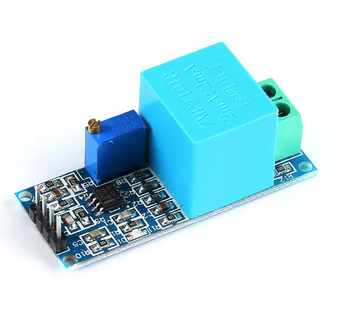
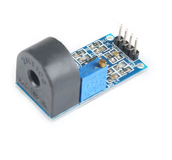

# Elektronik

## Analoges Interface für die Messung:

Für die Spannungsmessung:

Isolierender Transformator und Operationsverstäker:

{ width=40% }

Für die Strommessung: 

Berührungsfrei mit Messwandler, auch mit opAmp:

{ width=40% }
