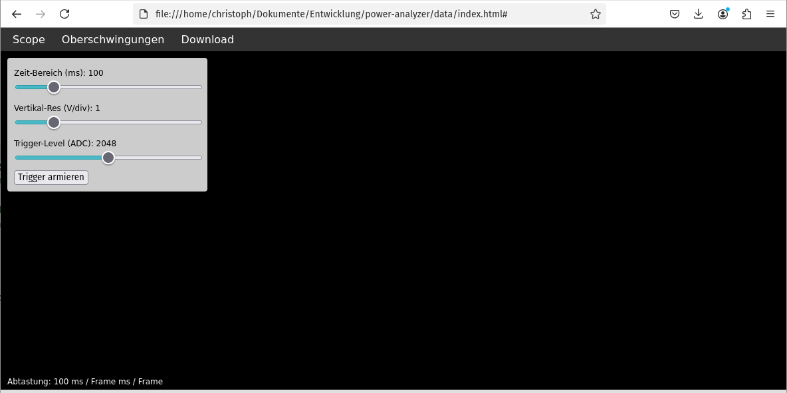
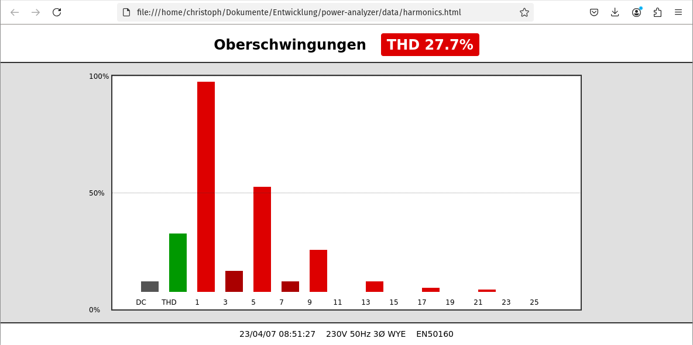

# Power Analyzer / Speicher-Oszilloskop

Ein ESP32 soll das 230 V AC Netz auf Netzrückwirkungen durch Verbraucher zu überwachen.

## Userinterface: 

http://< ESP-IP >/ oder Websocket

\break

## Oszilloskop:

- Echtzeit-Wellenformen
- Einstellbare Zeit-/Spannungs-Scale & Trigger



## Analyse der Oberschwingungen:

- DC-Anteil
- Harmonische 
- THD



## Download des Speichers (anders ausgdrückt: Aufnahme):

Klick Download -> speichert data.bin zur Auswertung z.B. in python.

## Logs:

    - ADC_FFT, HARMONICS, RECORDER -> ESP_LOG_INFO
    - httpd_ws, httpd_txrx -> ESP_LOG_DEBUG

\break

## Ordnerstruktur

```
.
|--  data/
| |-- index.html # Oszilloskop-Frontend
| |-- harmonics.html # Oberschwingungs-Frontend
|-- include/
| |-- adc_fft.h
| |-- config.h
| |-- harmonics.h
| |-- recorder.h
| |-- webserver.h
|-- src/
| |-- main.c
| |-- adc_fft.c
| |-- harmonics.c
| |-- recorder.c
| |-- webserver.c
|-- README.md
```

---

- ## Echtzeit-Oszilloskop (Spannung + Strom)

- **Oberschwingungs-/THD-Analyse** (DC + 1. bis 40. Harmonische)


  - **harmonics.c / harmonics.h**  
    Berechnet über FFT: DC-Anteil, 1. - 40. Harmonische und THD in % für Spannung und Strom.


- **Download** der letzten Messungen (interleaved Voltage, Current)

- **recorder.c / recorder.h**  
  Stellt über `/download` einen Binär-Stream bereit:
  1. Header: `uint32_t sample_rate, num_samples`  
  2. Daten: `float32`-Paare (Voltage, Current)

---

## Webserver-Komponente

- **webserver.c / webserver.h**  
  Startet HTTP- und WebSocket-Server, mountet SPIFFS und registriert alle Routen:

  | Route             | Methode      | Beschreibung                              |
  |-------------------|--------------|-------------------------------------------|
  | `/`               | GET          | `index.html` (Scope)                     |
  | `/harmonics.html` | GET          | `harmonics.html`                          |
  | `/harmonics`      | GET          | JSON mit DC, Harmonischen & THD           |
  | `/ws_scope`       | WS           | Live-Daten für Oszilloskop (V, I)         |
  | `/ws_harmonics`   | WS           | Live-Daten für Oberschwingungen           |
  | `/download`       | GET          | Binär-Dump der letzten 1024 Samples (V,I) |

---

## Installation & Build

1. **Vorbereitung**  
   - ESP-IDF installieren und Umgebung aktivieren  
   - Projekt-Ordner öffnen

2. **SPIFFS vorbereiten**  
   ```bash
   idf.py spiffs_gen

---

## Puffer-Daten des Oszilloskop

Die Zeit, die ein Puffer mit `FFT_SIZE` Samples bei einer Abtastrate von **200 kSPS** füllt, ist entscheidend für den horizontalen Maßstab eines Oszilloskops.


### Dauer in ms

- **Abtastrate** $f_s = \text{SAMPLE\_RATE} = 200\,000\ \mathrm{Samples/s}$  
- **Puffergröße** $N = \text{FFT\_SIZE} = 1024\ \mathrm{Samples}$

$$
T_\mathrm{ms}
= \frac{N}{f_s}
= \frac{1024}{200\,000} \times 1000
= 5{,}12\ \mathrm{ms}
$$

> **Bedeutung für das Oszilloskop:**  
> Ein Paar aus Spannung und Strom wird in nur **5,12 ms** abgebildet – das entspricht einer horizontalen Zeitauflösung von ca. **5 ms/div** (bei 10 Divisionen).

### Ringpuffer-Länge

Speichert man z. B. **10** Puffer hintereinander, deckt der Ringpuffer ab:

$$
10 \times 5{,}12\ \mathrm{ms} = 51{,}2\ \mathrm{ms}
$$

So erhält man eine „Vergangenheit“ von knapp **50 ms** für Scroll-Back.

---

### Extraktion zur Auswertung der Daten

Damit die Rohdaten nach dem Download bequem mit Python (z. B. NumPy) eingelesen werden können, speichern wir:

1. **Header** (im Binärformat):
   - `uint32_t sample_rate` (z. B. 200000)  
   - `uint32_t num_samples` (z. B. 1024)  

2. **Daten** als **float32**, **interleaved** $(V_0, I_0, V_1, I_1, \dots)$

Auf der PC-Seite lädt man sie dann z. B. mit:

```python
import numpy as np

with open('data.bin','rb') as f:
    sr = np.fromfile(f, dtype=np.uint32, count=1)[0]
    n  = np.fromfile(f, dtype=np.uint32, count=1)[0]
    data = np.fromfile(f, dtype=np.float32).reshape(-1, 2)
    voltage = data[:,0]
    current = data[:,1]
    t = np.arange(n) / sr
```


