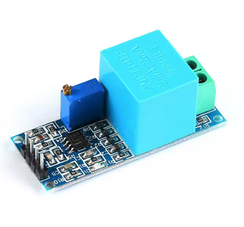
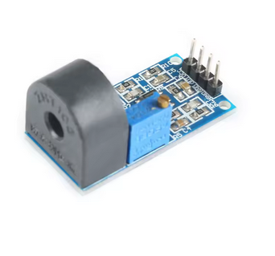

# Hardware

## ESP32 platform

The firmware is built around the ESP32 and uses continuous ADC acquisition together with DMA-backed buffering. Signal-processing and web-server tasks can therefore operate on blocks of samples instead of servicing every ADC sample individually.

## Voltage measurement

The original project concept uses an isolated voltage measurement front end based on a measurement transformer and analogue conditioning.

## Current measurement

Current is measured without a direct conductive connection using a current transformer and analogue conditioning.

## Analogue front end

Both measurement paths require conditioning appropriate to the ESP32 ADC input range. The exact component values, calibration and protection should be verified against the hardware revision being used.

> **Mains safety:** Galvanic isolation, creepage/clearance, fusing, enclosure design and component ratings must be appropriate for the installation. Do not connect an ESP32 ADC directly to mains voltage.

## Spectrum Analyzer enclosures

The original printable models and all reference pictures are preserved in
[`hardware/cad/spectrum-analyzer`](https://github.com/ChristophBellmann/power-analyzer/tree/main/hardware/cad/spectrum-analyzer).
`esp/files/` contains four ESP32 case STLs; `mic/files/` contains three microphone
enclosure STLs. The corresponding `images/` folders contain the original pictures.

- ESP32 WROOM case: **guillermohor**, [Thingiverse 4667813](https://www.thingiverse.com/thing:4667813), Creative Commons Attribution as stated in the supplied license.
- MAX4466 microphone enclosure: **jgutz20**, [Thingiverse 5634236](https://www.thingiverse.com/thing:5634236), Creative Commons Attribution Share Alike as stated in the supplied license.

The original README and LICENSE texts are retained alongside these folders.
They do not specify a license version; consult the original design page before
redistributing modifications. These third-party designs are not company-authored
CAD and are not covered by the repository's Apache software license.
