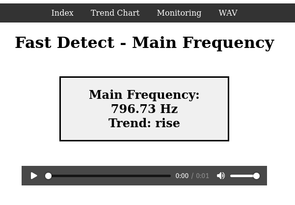
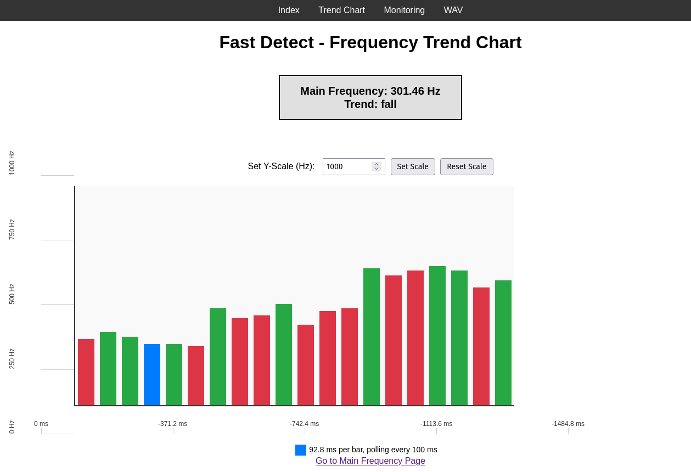
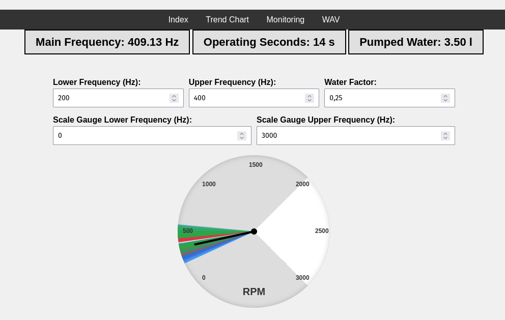

# Spectrum Analyzer

The Spectrum Analyzer is the audio/frequency firmware variant maintained in the
[Power Analyzer repository](https://github.com/ChristophBellmann/power-analyzer).
The two applications share ESP-DSP, but are built and flashed separately.

## Signal processing

```text
ESP32 ADC → continuous acquisition → normalization → FFT
→ dominant-frequency and trend analysis → WebSocket → browser
```

The firmware configures 44,100 samples/s and a 1024-point FFT: approximately
43.1 Hz per bin and a 22.05 kHz Nyquist limit. Historical claims of 441,000 samples/s
or a 44.1 kHz analysis range are not the current configuration. Hardware timing
and detection accuracy still need experimental verification.

## Firmware and frontend

See the [build instructions](build-and-installation.md) for both applications.
Spectrum Analyzer serves three browser interfaces:

- `/`: spectrum inspection, WAV playback and download (`/wav`).
- `/fastdetect`: frequency history and trend detection.
- `/monitoring`: frequency monitoring / RPM display.

All use the Spectrum firmware's `/ws` endpoint. They cannot be served as working
Spectrum interfaces by the electrical firmware, whose WebSocket API differs.







## Sources and analysis

In the canonical repository:

| Path | Purpose |
| --- | --- |
| `firmware/spectrum-analyzer/` | Separate ESP-IDF / PlatformIO application |
| `data/spectrum-analyzer/` | The three original browser UIs |
| `analysis/spectrum-analyzer/` | Both notebooks and WAV calculations |
| `hardware/cad/spectrum-analyzer/` | Seven STL models, enclosure images and original attribution |
| `docs/source/spectrum-analyzer/` | Adapted Pandoc sources and source logo |
| `docs/archive/spectrum-analyzer/` | Historical text and reference PDF outputs |
| `components/esp-dsp/` | Shared, pinned submodule |

Enclosures and licensing are described under [Hardware](hardware.md).
Original PDFs and their regeneration workflow are linked under
[Technical documents](technical-documents.md). Historical documentation includes
unfinished templates; it is preserved for provenance and is not a specification.
The [migration record](spectrum-analyzer-migration.md) accounts for every original
tracked file and documents the archive criteria.
